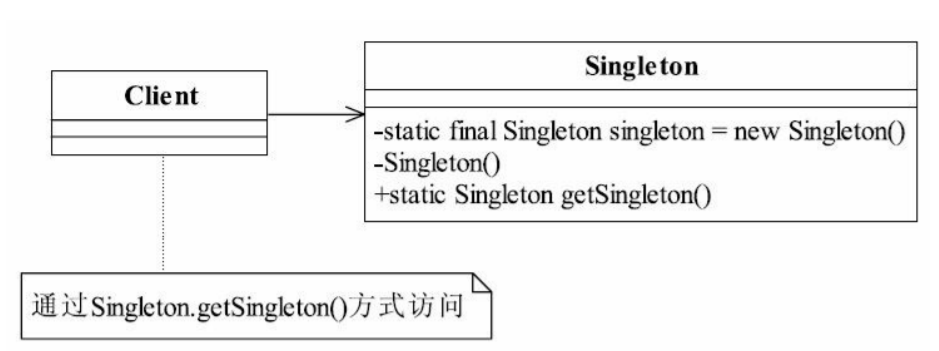

# 单例模式

- 设计模式之禅

## 定义

单例模式（Singleton Pattern）是一个比较简单的模式，其定义如下：
Ensure a class has only one instance, and provide a global point of access to it.
确保某一个类只有一个实例，而且自行实例化并向整个系统提供这个实例。 




```
// 饿汉式
class SingleObject {

    //创建 SingleObject 的一个对象
    private static SingleObject instance = new SingleObject();

    //让构造函数为 private，这样该类就不会被实例化
    private SingleObject(){}

    //获取唯一可用的对象
    public static SingleObject getInstance(){
        return instance;
    }

    public void showMessage(){
        System.out.println("Hello World!");
    }
}

```


```

// 懒汉式，线程安全
 class Singleton {
    private static Singleton instance;
    private Singleton (){}
    public static synchronized Singleton getInstance() {
        if (instance == null) {
            instance = new Singleton();
        }
        return instance;
    }
     public void showMessage(){
         System.out.println("Hello World2!");
     }
}


```