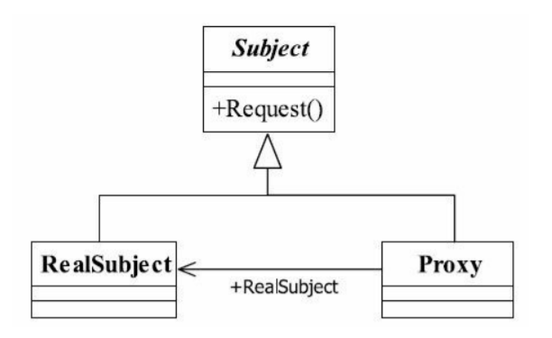

# 代理模式
- https://www.cnblogs.com/whirly/p/10154887.html
- https://zhuanlan.zhihu.com/p/36550730

## 代理模式定义

Provide a surrogate or placeholder for another object to control access to it.
为其他对象提供一种代理以控制对这个对象的访问。 

**代理Proxy 和原来RealSubject 实现同一个接口**

## 静态代理
- 示例proxy1
 

## 强制代理
- 强制代理2

## 动态代理
- 动态代理3

## 代理模式与装饰模式区别

- 1. 代理模式是把当前的行为或功能委托给其他对象执行，代理类负责接口限定：是否可以调用真实角色，以及是否对发送到真实角色的消息进行变形处理，  
     它不对被主题角色（也就是被代理类）的功能做任何处理，保证原汁原味的调用。代理模式使用到极致开发就是 AOP，    
     这是各位采用Spring架构开发必然要使用到的技术，它就是使用了代理和反射的技术。   
- 2. 装饰模式是在要保证接口不变的情况下加强类的功能，它保证的是被修饰的对象功能比原始对象丰富（当然，也可以减弱），但不做准入条件判断和准入参数过滤，
     如是否可以执行类的功能，过滤输入参数是否合规等，这不是装饰模式关心的。  