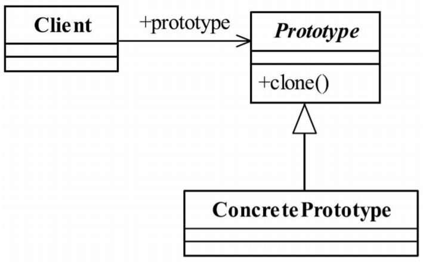

# 原型模式
- https://blog.csdn.net/qq_40709468/article/details/82316418

Specify the kinds of objects to create using a prototypical instance,and create new objects by copying this prototype.     
用原型实例指定创建对象的种类，并且通过拷贝这些原型创建新的对象。

原型模式的核心是一个clone方法，通过该方法进行对象的拷贝，Java 提供了一个Cloneable接口来**标示**这个对象是可拷贝的。
为什么说是“标示”呢？翻开JDK的帮助看看Cloneable是一个方法都没有的，这个接口只是一个标记作用，
在JVM中具有这个标记 的对象才有可能被拷贝。那怎么才能从“有可能被拷贝”转换为“可以被拷贝”呢？
方法是覆盖 clone()方法，该方法继承自Object类(每个类默认都是继承Object类)
 

## 浅拷贝1

示例 ：浅拷贝1

## 深拷贝

示例 ：深拷贝2

##  

