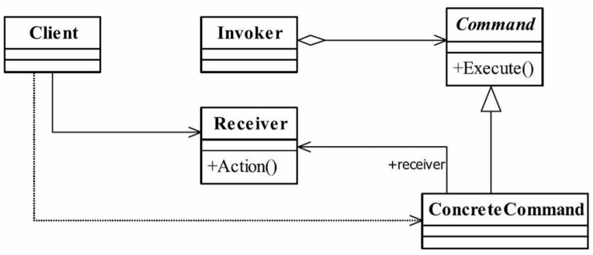

# 工厂模式

- https://stackoverflow.com/questions/32597736/why-should-i-use-the-command-design-pattern-while-i-can-easily-call-required-met
- https://www.geeksforgeeks.org/command-pattern/
- https://www.cnblogs.com/konck/p/4199907.html 

## 命令模式定义
 
命令模式调用：

 **Client** calls => **Invoker** =>  calls **ConcreteCommand** =>  calls **Receiver**  method, which implements abstract Command method.
 
 
 命令模式是一个高内聚的模式，其定义为：Encapsulate a request as an object,thereby letting you parameterize clients with different requests,queue or log requests,and support undoable
 operations.
 将一个**请求**封装成一个**对象**，从而让你使用不同的请求把客户端参数化，对请求排队或者记录请求日志，可以提供命令的撤销和恢复功能。
 
 
 ## 命令模式的优点
 
 
- 类间解耦
 调用者角色与接收者角色之间没有任何依赖关系，调用者实现功能时只需调用Command抽象类的execute方法就可以，不需要了解到底是哪个接收者执行。
- 可扩展性
 Command的子类可以非常容易地扩展，而调用者Invoker和高层次的模块Client不产生严重的代码耦合。
- 命令模式结合其他模式会更优秀
 命令模式可以结合责任链模式，实现命令族解析任务；结合模板方法模式，则可以减少Command子类的膨胀问题。
 
## 命令模式的缺点
 命令模式也是有缺点的，请看Command的子类：如果有N个命令，Command的子类就可不是几个，而是N个，这个类膨胀得非常大，这个就需要读者在项 目中慎重考虑使用。

## 命令模式的应用场景
 
命令模式通常适用于以下场景。
- 请求调用者需要与请求接收者解耦时，命令模式可以使调用者和接收者不直接交互。
- 系统随机请求命令或经常增加、删除命令时，命令模式可以方便地实现这些功能。
- 当系统需要执行一组操作时，命令模式可以定义宏命令来实现该功能。
- 当系统需要支持命令的撤销（Undo）操作和恢复（Redo）操作时，可以将命令对象存储起来，采用备忘录模式来实现。

数据库中的事务机制的底层实现、JDK 中的Runable是 典型命令模式

