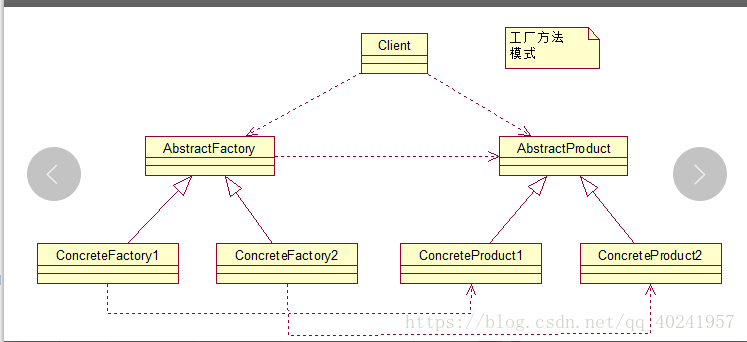
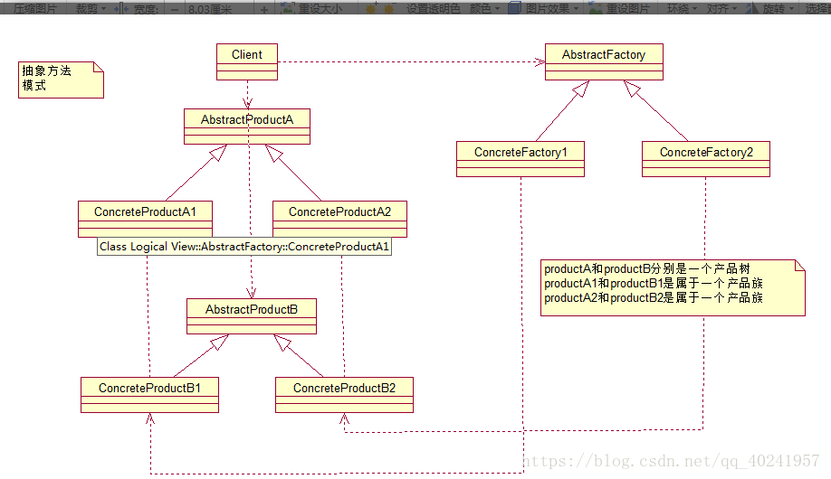

# 工厂模式

- https://www.zhihu.com/question/27125796/answer/688147580
- https://zhuanlan.zhihu.com/p/31287344
- https://zhuanlan.zhihu.com/p/61098478
- 设计模式之禅

工厂模式分成三种：

1. 简单/静态工厂模式
2. 工厂方法模式
3. 抽象工厂模式




## 引子  为什么要用工厂模式？

如创建BufferedReader对象 ：

``` 
// 创建一个BufferedReader对象
 BufferedReader bf = new BufferedReader(new FileReader(new File("aa.txt")));

```

如果项目中很多地方（比如很多类中）都用到 BufferedReader对象 ，需要重复写，另外，如果需要将BufferedReader改为 LineNumberReader，需要到处修改。

解决办法：

```
// 创建Reader对象的工厂
public class ReaderFactory {
    public static Reader getReader() throws FileNotFoundException {
        File file = new File("aa.txt");
        FileReader fileReader = new FileReader(file);
        BufferedReader reader = new BufferedReader(fileReader);
        return reader;
    }
}

/////////////////////////
public class FileOperateA {
    public static void main(String[] args) throws FileNotFoundException {
        //-------原来的方式
        //File file = new File("aa.txt");
        //FileReader fileReader = new FileReader(file);
        //BufferedReader bufferedReader = new BufferedReader(fileReader);
 
		// 用工厂来创建出对象
        Reader reader = ReaderFactory.getReader();
        // 读写文件....
    }
}

```


##  简单/静态工厂模式
又名静态方法模式，是由一个工厂对象决定创建出哪一种产品类的实例。

```
// 手机的基类

interface IPhone {
    void call();
}
// 小米、华为两个手机类

class MiPhone implements IPhone {
    @Override
    public void call() {}
}

class HwPhone implements IPhone {
    @Override
    public void call() {}
}

//创建一个简单工厂类
class PhoneFactory {
    public static IPhone phone;
    public static IPhone produce(String phoneType) {
        switch (phoneType) {
            case "mi":
                phone = new MiPhone();
                break;
            case "huawei":
                phone = new HwPhone();
                break;
            default:
                phone = null;
        }
        return phone;
    }
}
 


```
 
使用：传入不同的字符串来调用工厂类的静态方法创建不同具体产品类的实例
 
```
IPhone miPhone = PhoneFactory.produce("mi");
IPhone HwPhone = PhoneFactory.produce("huawei");
 
```
 


## 工厂模式定义

工厂方法模式使用的频率非常高， 其定义为：
Define an interface for creating an object,but let subclasses decide which class to
instantiate.Factory Method lets a class defer instantiation to subclasses.
定义一个用于创建对象的接口，让子类决定实例化哪一个类。工厂方法使一个类的实例化延迟到其子类。

在数据库开发中，大家应该能够深刻体会到工厂方法模式的好处：如果使用JDBC连接数据库，数据库从MySQL切换到Oracle，需要改动的地方就是切换一下驱动名称（前提
条件是SQL语句是标准语句），其他的都不需要修改，这是工厂方法模式灵活性的一个直接案例。

例如需要设计一个连接邮件服务器的框架，有三种网络协议可供选择：POP3、IMAP、HTTP，我们就可以把这三种连接方法作为产品类，定义一个接口如IConnectMail，   
然后定义对邮件的操作方法，用不同的方法实现三个具体的产品类（也就是连接方式）再定义一个工厂方法，按照不同的传入条件，选择不同的连接方式。


简单/静态工厂模式是在工厂方法模式上缩减，抽象工厂模式是在工厂方法模式上再增强。


1. 手机的基类及实现类
```
//手机的基类
interface IPhone {
    void call();
}


//小米、华为两个手机类
class MiPhone implements IPhone {
    @Override
    public void call() {}
}

class HwPhone implements IPhone {
    @Override
    public void call() {}
}
```
 
2. 工厂接口及实现类


```

// 工厂接口
interface IPhoneFactory {
    IPhone produce();
}


// 小米手机的工厂类 

class MiPhoneFactory implements IPhoneFactory {
    @Override
    public IPhone produce() {
        return new MiPhone();
    }
}

//  华为手机的工厂类 
class HwPhoneFactory implements IPhoneFactory {
    @Override
    public IPhone produce() {
        return new HwPhone();
    }
}
 
```
使用工厂创建对象：

```
IPhone miPhone = new MiPhoneFactory().produce();
IPhone hwPhone = new HwPhoneFactory().produce();

```

 


## 抽象工厂模式
 
为创建一组相关或相互依赖的对象提供一个接口，而且无需指定他们的具体类。

这一组相关或者相互依赖的对象有一个名词来形容就是**产品族**。


如手机和手机壳

```
// 手机的接口
interface IPhone {
    void call();
}

//小米手机类
class MiPhone implements IPhone {
    @Override
    public void call() {}
}

//华为两个手机类
class HwPhone implements IPhone {
    @Override
    public void call() {}
}


//手机套的接口
interface IPhoneCase {
    void call();
}

// 小米手机套类
class MiPhoneCase implements IPhoneCase {
    @Override
    public void protect() {}
}

// 华为手机套类
class HwPhoneCase implements IPhoneCase {
    @Override
    public void protect() {}
}
```

创建生产小米手机的工厂类和生产华为手机的工厂类:

``` 

interface IPhoneFactory {
    IPhone producePhone();
    IPhoneCase producePhoneCase();
}

// 小米手机工厂
class MiPhoneFactory implements IPhoneFactory {
    @Override
    public IPhone producePhone() {
        return new MiPhone();
    }
    @Override
    public IPhoneCase producePhoneCase() {
        return new MiPhoneCase();
    }
}

// 华为手机工厂
class HwPhoneFactory implements IPhoneFactory {
    @Override
    public IPhone producePhone() {
        return new HwPhone();
    }
    @Override
    public IPhoneCase producePhoneCase() {
        return new HwPhoneCase();
    }
}

```


 

使用：

```
public static void main(String[] args) {


        //生产小米手机和手机壳
        IPhoneFactory xm = new MiPhoneFactory();
        IPhone  xmPhone = xm.producePhone();
        IPhoneCase  xmPhoneCase = xm.producePhoneCase();
       

        //生产华为手机和手机壳
        IPhoneFactory hw = new HwPhoneFactory();
        IPhone  hwPhone = hw.producePhone();
        IPhoneCase  hwPhoneCase = hw.producePhoneCase();

    }

```

简单来说：**工厂方法**模式的工厂是创建出**一种产品**，而**抽象工厂**是创建出**一类产品（产品族）**;


