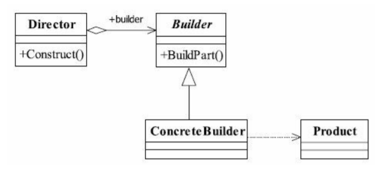
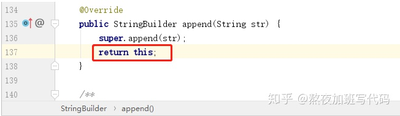
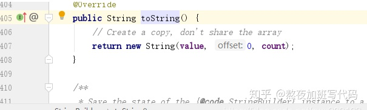
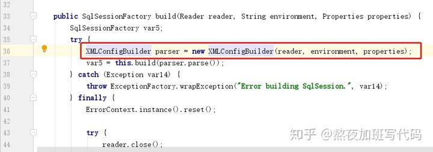

# 建造者模式

 
- 设计模式之禅
- https://zhuanlan.zhihu.com/p/143101326
- https://zhuanlan.zhihu.com/p/266392844
- https://zhuanlan.zhihu.com/p/58093669
- https://www.jianshu.com/p/3d1c9ffb0a28
- https://blog.csdn.net/ljcitworld/article/details/80387378


## 建造者模式定义

建造者模式（Builder Pattern）也叫做生成器模式，其定义如下：
Separate the construction of a complex object from its representation so that the same
construction process can create different representations.
将一个**复杂对象**的**构建与它的表示分离**，使得同样的构建过程可以创建不同的表示。

## 建造者模式类图



- 指挥者（Director）直接和客户（Client）进行需求沟通；
- 沟通后指挥者将客户创建产品的需求划分为各个部件的建造请求（Builder）；
- 将各个部件的建造请求委派到具体的建造者（ConcreteBuilder）；
- 各个具体建造者负责进行产品部件的构建,最终构建成具体产品（Product）。
 
Client => 使用  Director => 调用 ConcreteBuilder的方法  


## 建造者模式的使用场景：
- 相同的方法，不同的执行顺序，产生不同的事件结果时，可以采用建造者模式。
- 多个部件或零件，都可以装配到一个对象中，但是产生的运行结果又不相同时，则可以使用该模式。
- 产品类非常复杂，或者产品类中的调用顺序不同产生了不同的效能，这个时候使用建造者模式非常合适。
- 在对象创建过程中会使用到系统中的一些其他对象，这些对象在产品对象的创建过程中不易得到时，也可以采用建造者模式封装该对象的创建过程。
该种场景只能是一个补偿方法，因为一个对象不容易获得，而在设计阶段竟然没有发觉，而要通过创建者模式柔化创建过程，本身已经违反设计的最初目标。
- 初始化一个对象特别复杂，参数多，而且很多参数都具有默认值。


## 建造者模式和工厂模式区别
建造者模式优点类似于工厂模式，都是用来创建一个对象，但是他们还是有很大的区别，主要区别如下：

- 1、建造者模式更加注重方法的调用顺序，工厂模式注重于创建完整对象
- 2、建造者模式根据不同的产品零件和顺序可以创造出不同的产品，而工厂模式创建出来的产品都是一样的
- 3、建造者模式使用者需要知道这个产品有哪些零件组成，而工厂模式的使用者不需要知道，直接创建就行


 
## 示例
用 builder 模式创建共享单车为例子：build1

产品类：
```
public class Bike { 

    private IFrame frame; 
    private ISeat seat; 
    private ITire tire; 
    
    ...get set
}

```

Builder 类：
```
// 抽象 builder 类 
public abstract class Builder { 
    abstract void buildFrame(); 
    abstract void buildSeat(); 
    abstract void buildTire(); 
    abstract Bike build(); 
} 
```

ConcreteBuilder 类 :

```
// 具体 builder 类 
public class MobikeBuilder extends Builder{ 
    private Bike mBike = new Bike(); 
    @Override 
    void buildFrame() { 
        mBike.setFrame(new AlloyFrame()); 
    } 
    @Override 
    void buildSeat() { 
        mBike.setSeat(new DermisSeat()); 
    } 
    @Override 
    void buildTire() { 
        mBike.setTire(new SolidTire()); 
    } 
    @Override 
    Bike build() { 
        return mBike; 
    } 
} 

public class OfoBuilder extends Builder{ 
    private Bike mBike = new Bike(); 
    @Override 
    void buildFrame() { 
        mBike.setFrame(new CarbonFrame()); 
    } 
    @Override 
    void buildSeat() { 
        mBike.setSeat(new RubberSeat()); 
    } 
    @Override 
    void buildTire() { 
        mBike.setTire(new InflateTire()); 
    } 
    @Override 
    Bike build() { 
        return mBike; 
    } 
} 

```

指挥者类：

```
public class Director { 
    private Builder mBuilder = null; 
    public Director(Builder builder) { 
        mBuilder = builder; 
    } 
    public Bike construct() { 
        mBuilder.buildFrame(); 
        mBuilder.buildSeat(); 
        mBuilder.buildTire(); 
        return mBuilder.build(); 
    } 
}
```

客户端使用：

```
public class Click { 
    public static void main(String[] args) { 
        showBike(new OfoBuilder()); 
        showBike(new MobikeBuilder()); 
    } 
    private void showBike(Builder builder) {
        Director director = new Director(builder); 
        Bike bike = director.construct(); 
        bike.getFrame().frame(); 
        bike.getSeat().seat(); 
        bike.getTire().tire(); 
    } 
} 
```

！以上可以**简化**(director 合并到 Builder)：

```
public abstract class NewBuilder { 
    abstract void buildFrame(); 
    abstract void buildSeat(); 
    abstract void buildTire(); 
    abstract Bike build(); 
    /** 
    * 把导演类中的construct()方法合并到抽象建造者类中 
    * 
    * @return 具体产品对象 
    */ 
    public Bike construct() { 
        this.buildFrame(); 
        this.buildSeat(); 
        this.buildTire(); 
        return this.build(); 
    } 
} 
```

## 建造者模式在源码中体现

1、jdk源码中，StringBuilder类,append方法就是给我们提供了一种链式创建对象的方法：



然后toString方法返回了一个完整的对象：

 
2、MyBatis中SqlSessionFactoryBuiler中就用到了建造者模式。



3、Android的AlertDialog ：

```
  AlertDialog dialog = new AlertDialog.Builder(getContext())
              .setTitle("标题")
              .setMessage("内容")
              .setPositiveButton("确定", null)
              .setPositiveButton("取消", null)
              .create();
  dialog.show();
```

 


建造者模式和工厂模式区别
建造者模式优点类似于工厂模式，都是用来创建一个对象，但是他们还是有很大的区别，主要区别如下：

1、建造者模式更加注重方法的调用顺序，工厂模式注重于创建完整对象
2、建造者模式根据不同的产品零件和顺序可以创造出不同的产品，而工厂模式创建出来的产品都是一样的
3、建造者模式使用者需要知道这个产品有哪些零件组成，而工厂模式的使用者不需要知道，直接创建就行


