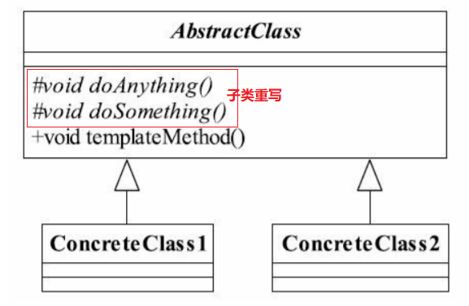

# 模板方法模式

 
- 设计模式之禅

## 模板方法定义

模板方法模式（Template Method Pattern）定义如下：
Define the skeleton of an algorithm in an operation,deferring some steps to subclasses.Template
Method lets subclasses redefine certain steps of an algorithm without changing the algorithm's
structure.
定义一个操作中的算法的框架，而将一些步骤延迟到子类中。使得子类可以不改变一个算法的结构即可重定义该算法的某些特定步骤。




public abstract class AbstractClass {

    //基本方法 -- 预留给子类重写
    protected abstract void doSomething();

    //基本方法 -- 预留给子类重写
    protected abstract void doAnything();

    //模板方法
    public void templateMethod(){
        /*
        * 调用基本方法，完成相关的逻辑
        */
        this.doAnything();
        this.doSomething();
    }
}
 
```
public class ConcreteClass1 extends AbstractClass {
    // 子类 ConcreteClass1 重写
    protected void doAnything() {
    //业务逻辑处理
    }
    
    // --子类 ConcreteClass1 重写
    protected void doSomething() {
    //业务逻辑处理
    }
}


public class ConcreteClass2 extends AbstractClass {
   
    // --子类 ConcreteClass2 重写
    protected void doAnything() {
    //业务逻辑处理
    }
    
    //  --子类 ConcreteClass2 重写
    protected void doSomething() {
    //业务逻辑处理
    }
}

```
使用模板方法
``` 
 
public class Client {
    public static void main(String[] args) {
        AbstractClass class1 = new ConcreteClass1();
        AbstractClass class2 = new ConcreteClass2();
        //调用模板方法
        class1.templateMethod();
        class2.templateMethod();
    }
}


```


 


