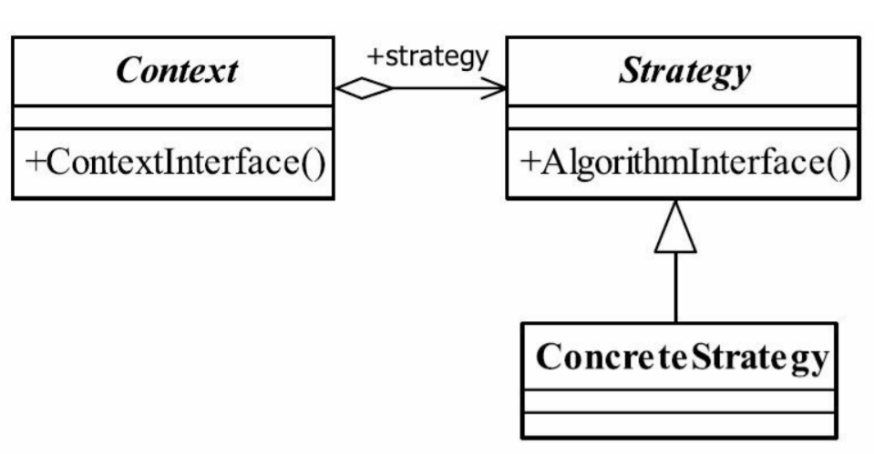

# 策略模式

- https://www.cnblogs.com/lewis0077/p/5133812.html


## 策略模式定义

策略模式（Strategy Pattern）也叫做政策模式（PolicyPattern）。其定义如下：
Define a family of algorithms,encapsulate each one,and make them interchangeable.   
定义一组算法，将每个算法都封装起来，并且使它们之间可以互换。


## 示例

示例场景： 根据用户类型不同，计算不同的商品价格

- 不使用设计模式，直接定义一个类QuoteManager，使用其方法quote 定义不同的情景下的价格

```

public class QuoteManager {
    //  添加一个该种客户类型的报价算法方法，然后再quote方法中再加一个else if的分支
    public BigDecimal quote(BigDecimal originalPrice, String customType){
        if ("新客户".equals(customType)) {
            System.out.println("抱歉！新客户没有折扣！");
            return originalPrice;
        }else if ("老客户".equals(customType)) {
            System.out.println("恭喜你！老客户打9折！");
            originalPrice = originalPrice.multiply(new BigDecimal(0.9)).setScale(2,BigDecimal.ROUND_HALF_UP);
            return originalPrice;
        }else if("VIP客户".equals(customType)){
            System.out.println("恭喜你！VIP客户打8折！");
            originalPrice = originalPrice.multiply(new BigDecimal(0.8)).setScale(2,BigDecimal.ROUND_HALF_UP);
            return originalPrice;
        }
        //其他人员都是原价
        return originalPrice;
    }
}


public class Test {
    public static void main(String[] args) {
        QuoteManager qm = new QuoteManager();
        BigDecimal originalPrice = new BigDecimal(1000);

        String customer1 = "老客户";
        BigDecimal price1 = qm.quote(originalPrice,customer1);
        System.out.println(price1);

        System.out.println("*******************************");

        String customer2 = "VIP客户";
        BigDecimal price2 = qm.quote(originalPrice,customer2);
        System.out.println(price2);
    }
}

```

缺点：增加一个该种客户类型的报价算法方法或者修改不同用户的折扣方式，需要在quote方法中再加一个else if的分支，该方法需变更，造成QuoteManager类的修改


改进：使用策略模式：

``` 
// 策略算法接口
public interface IQuoteStrategy {
    //获取折后价的价格
      BigDecimal getPrice(BigDecimal originalPrice);
}

// 新客户算法
public class NewCustomerQuoteStrategy implements IQuoteStrategy {
    @Override
    public BigDecimal getPrice(BigDecimal originalPrice) {
        System.out.println("抱歉！新客户没有折扣！");
        return originalPrice;
    }
}

// 旧客户算法
public class OldCustomerQuoteStrategy implements IQuoteStrategy {
    @Override
    public BigDecimal getPrice(BigDecimal originalPrice) {
        System.out.println("恭喜！老客户享有9折优惠！");
        originalPrice = originalPrice.multiply(new BigDecimal(0.9)).setScale(2,BigDecimal.ROUND_HALF_UP);
        return originalPrice;
    }
}

......

```


```

//报价上下文角色 --- 根据传入的报价算法计算价格
public class QuoteContext {
    //持有一个具体的报价策略
    private IQuoteStrategy quoteStrategy;

    //注入报价策略
    public QuoteContext(IQuoteStrategy quoteStrategy){
        this.quoteStrategy = quoteStrategy;
    }

    //回调具体报价策略的方法
    public BigDecimal getPrice(BigDecimal originalPrice){
        return quoteStrategy.getPrice(originalPrice);
    }
}
```


结果测试：

```
//外部客户端
public class Client {
    public static void main(String[] args) {
        //1.创建老客户的报价策略
        IQuoteStrategy oldQuoteStrategy = new OldCustomerQuoteStrategy();

        //2.创建报价上下文对象，并设置具体的报价策略
        QuoteContext quoteContext = new QuoteContext(oldQuoteStrategy);

        //3.调用报价上下文的方法
        BigDecimal price = quoteContext.getPrice(new BigDecimal(100));

        System.out.println("折扣价为：" +price);
    }
}

```


## 策略模式的优点
- 算法可以自由切换
这是策略模式本身定义的，只要实现抽象策略，它就成为策略家族的一个成员，通过封装角色对其进行封装，保证对外提供“可自由切换”的策略。
- 避免使用多重条件判断
如果没有策略模式，我们想想看会是什么样子？一个策略家族有5个策略算法，一会要使用A策略，一会要使用B策略，怎么设计呢？使用多重的条件语句？多重条件语句不易维
护，而且出错的概率大大增强。使用策略模式后，可以由其他模块决定采用何种策略，策略家族对外提供的访问接口就是封装类，简化了操作，同时避免了条件语句判断。
- 扩展性良好
这甚至都不用说是它的优点，因为它太明显了。在现有的系统中增加一个策略太容易了，只要实现接口就可以了，其他都不用修改，类似于一个可反复拆卸的插件，这大大地符合了OCP原则。

##  策略模式的缺点

- 策略类数量增多
每一个策略都是一个类，复用的可能性很小，类数量增多。
- 所有的策略类都需要对外暴露
上层模块必须知道有哪些策略，然后才能决定使用哪一个策略，这与迪米特法则是相违背的，我只是想使用了一个策略，我凭什么就要了解这个策略呢？那要你的封装类还有什么
意义？这是原装策略模式的一个缺点，幸运的是，我们可以使用其他模式来修正这个缺陷，如工厂方法模式、代理模式或享元模式。


## 策略模式的使用场景
- 多个类只有在算法或行为上稍有不同的场景。
- 算法需要自由切换的场景。
例如，算法的选择是由使用者决定的，或者算法始终在进化，特别是一些站在技术前沿的行业，连业务专家都无法给你保证这样的系统规则能够存在多长时间，在这种情况下策略模式是你最好的助手。
- 需要屏蔽算法规则的场景。


